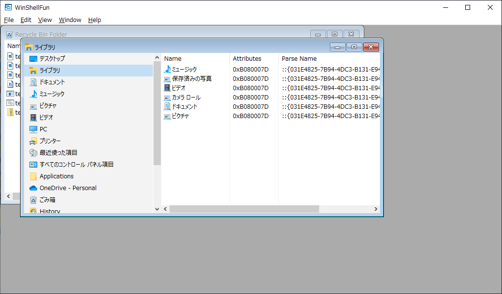

# WinShellFun
 
**0.2.6.0 Preview**

現在のバージョンでは以下の情報をMDI子ウィンドウに表示します。

- **Shell Folder Contents Browser**   

  シェルのフォルダに含まれるアイテムの解析名を表示します。

   

   左のペインに表示されるシェルフォルダ一覧は、winshellfun.iniファイルに定義されています。

   >※"God Mode"フォルダは初期状態ではコメントアウトされています。表示したい場合はwinshellfun.iniの下記の行のコメントを外してください（行頭の ; を消す）。
   >
   >``` ;{ED7BA470-8E54-465E-825C-99712043E01C} ; CLSID_All_Tasks (God Mode) ```
   >
   >上記を有効にすると%TEMP%フォルダに、GodModeフォルダを作成するので注意してください。

- **Recycle Bin Folder Viewer**   

   ごみ箱に入っているファイルの情報を表示します。   
   コンテキストメニュー（項目を選択して右クリック）から、選択したファイルの復元または削除が選択できます。


### 既知の問題

- Shell Folder Contents Browserで History フォルダを選択した時、リストに表示される項目をダブルクリックするとウィンドウが消えて終了します。   
（項目をオープンする際にShellExecuteEx APIを呼び出すとAPI内部でスタックオーバーフローを起こしてエラー終了する）   
気になる場合はwinshellfun.iniから ``` {D9DC8A3B-B784-432E-A781-5A1130A75963} ; FOLDERID_History ``` 行をコメントアウトしてください（行頭に ; を挿入する）。


## 使い方

1. winshellfun.exeを実行します。

1. 左のフォルダ一覧からフォルダを選択します。

1. 右のペインをフォーカスし、メニューの \[Edit\] > \[Copy\] から（または Ctrl+C キー押下）選択テキストのコピーができます。

1. 右ペインの項目をダブルクリックすると項目を開きます。

※ ソースからビルドした場合は、iniフォルダにあるwinshellfun.iniを実行ファイルと同じ場所にコピーしてください。

> コマンドラインスイッチ(仮)   
>
> -fb 起動時に Shell Folder Contents Browser を開きます。   
> -rb 起動時に Recycle Bin Folder Viewer を開きます。   
> -mx MDI子ウィンドウを最大化で開きます。   
>
> オプションスイッチを指定しない場合は、Shell Folder Contents Browserが非最大化で開きます。
>
> ※各スイッチは現状は仮のものです。

## Build 方法

### 開発環境
ソースからビルドするには　Windows Driver Kit Version 7.1.0 (WDK) と Windows SDK for Windows 7 and .NET Framework 4 (Veriosn 7.1)が必要です。

https://www.microsoft.com/en-us/download/details.aspx?id=11800

https://www.microsoft.com/en-us/download/details.aspx?id=8442

>ISOファイルを使ってSDKをインストールする場合、プラットフォームごとに異なるので注意してください。   
>64bit環境にインストールする時は GRMSDKX_EN_DVD.iso を、
>32bit環境にインストールする時は GRMSDK_EN_DVD.iso をダウンロードしてください。
>適合しないファイルを使用するとエラーとなりインストールできません。


現在のビルド環境は、上記WDKとSDKが以下の場所にインストールされている前提になっています。WDKはデフォルトで下記の場所になっていますが、SDKのデフォルトは異なっているので注意してください。

WDK   
`C:\WinDDK\7600.16385.1`

SDK   
`C:\WinSDK\7.1`

もし別の場所にインストールされている場合は、その場所へのリンクを持つ上記パスと同じ名前のジャンクションポイントをC:ドライブのルートに作成すると便利です。

例)
`C:\WinSDK\7.1 -> C:\Program Files\Microsoft SDKs\v7.1`

>**Warning**   
>現状、ビルドに使用するsourcesファイル内に記述されたWDK/SDKルートパスがハードコードされているためです。
>独自のインストール先を設定したい場合は、sourcesファイルを編集して当該パスを調整する必要があります。
>編集する場合、sourcesファイルに記述するパスにはスペースを含めないでください。

> **Note**   
>SDKのセットアップは、マウントされた(またはCD/DVD)ドライブのルートにあるsetup.exeではなく、Setupフォルダ下のSDKSetup.exe を実行してください。   
> `\Setup\SDKSetup.exe`
>
>
>もしインストール時にエラーが発生した場合は、以下のVS2010再頒布モジュールをアンインストールしてから再度試してみてください。
>
>`Microsoft Visial C++ 2010 x86 Redistributable - 10.0.xxxxx`   
>`Microsoft Visial C++ 2010 x64 Redistributable - 10.0.xxxxx`

> **Note**   
>SDKから最低限必要なものは、ヘッダファイルとライブラリファイルのみです。コンパイラやツールは不要です。


<br>

### ビルド手順
スタートメニューの以下の項目を開きます。

`Windows Driver Kits > WDK 7600.16385.1 > Build Environments>Windows 7`

から

64ビット版をビルドする場合は、`x64 Free Build Environment`

32ビット版をビルドする場合は、 `x86 Free Build Environment`

のどちらかを開きます。

> **Warning**   
Windows 10ではスタートメニュー(Windows Driver Kits)から適切な開発環境を選べない場合があります（各OS別ビルドターゲットフォルダ下に、それぞれ同じ名前でリンクファイル存在するための様です）。
正しく選択できない場合は、シェルリンクがあるスタートアップメニューのフォルダを開いて直接選択してください。

<br>
コマンドプロンプトが開くので、ソースの展開先ディレクトリへ移動して、以下のbuildコマンドを実行します。
<br>
<br>

    build -c

最初のビルドでは以下のオプションをお勧めします。

    build -c -M 1


## License

Copyright (C) YAMASHITA Katsuhiro. All rights reserved.

Licensed under the [MIT](LICENSE) License.
